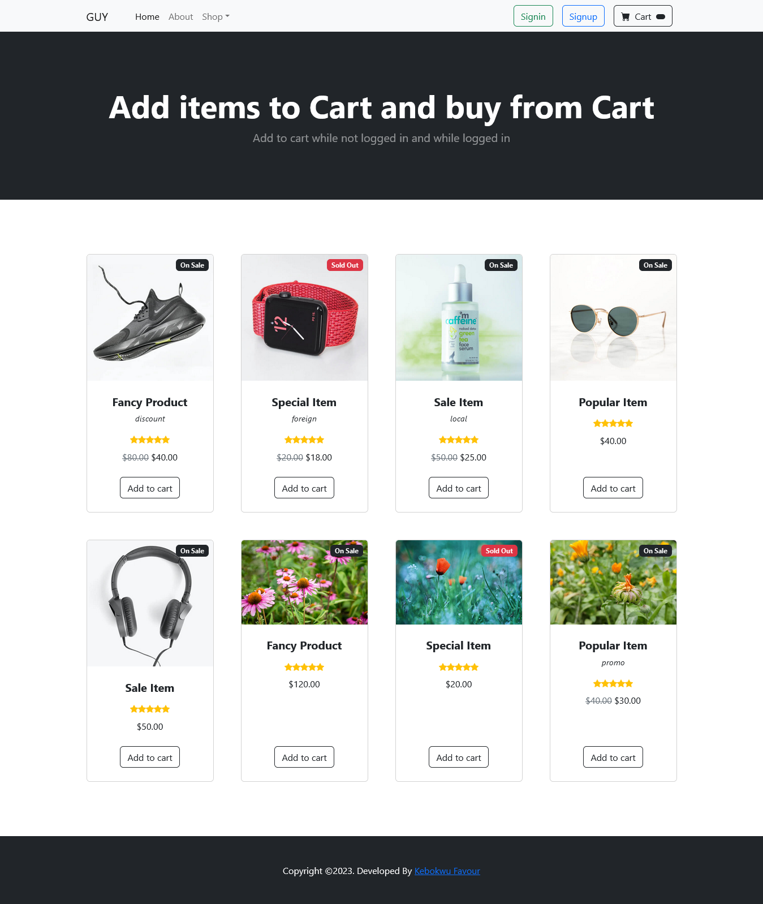

# E-Commerce Personal Project

Welcome to the E-Commerce Personal Project repository. This project serves as a personal exploration of building an e-commerce website.



## Table of Contents

- [Introduction](#introduction)
- [Features](#features)
- [Getting Started](#getting-started)
- [Usage](#usage)
- [Contributing](#contributing)

## Introduction

This project is an endeavor to create a functional e-commerce website from scratch. It is designed for educational and personal development purposes, aiming to explore various aspects of web development, including front-end and back-end technologies. Also aiming to showcase my skill of properly working with secure cookies and proper session management for better user experiences; ensuring proper syncronization between the cookie and session (database).

## Features

- **Product Catalog**: Browse and view a wide range of products from the home page.
- **User Authentication**: Register, log in, and manage your user account.
- **Shopping Cart**: Add, remove, and update items in your shopping cart while logged in or not. Items added to shopping cart when not signed in, syncs with your shopping cart when signed in.
<!-- - **Order Management**: View your order history and order details. -->
- **Checkout**: Complete orders securely with various payment options with the paystack payment gateway.
- **Responsive Design**: Ensures a seamless shopping experience on different devices.

Feel free to explore and suggest enhancements or new features to further develop this project.

## Getting Started

To get a local copy of this project up and running, follow these steps:

1. **Clone the Repository**:

   ```bash
   git clone https://github.com/KebokwuFavour/e-commerce_personal.git
   cd e-commerce_personal
   ```

## Usage

This section provides instructions on how to use and interact with the E-Commerce Personal Project. It covers various aspects of the application, including user roles, navigation, and key features.

### User Roles

The E-Commerce Personal Project involves different user roles, each with its set of actions and privileges. Here are the main user roles:

- **Guest**: A visitor who hasn't logged in but can browse. Can add, remove, and update items in their shopping cart.
- **Customer**: A registered user who can browse, shop, and manage their account. Can add, remove, and update items in their shopping cart. Can purchase products by proceeding to checkout from their shopping cart.

### Navigation

#### Home Page

- The home page welcomes users with featured products.
- It provides quick links to the shopping cart.
- Customers can log in or register to access their account.

#### Shopping Cart

- The shopping cart allows customers to review and manage their selected items.
- Users can update quantities, remove items, and proceed to checkout.

#### Checkout

- Customers can complete their purchase by proceeding to checkout.
- The checkout process is secure and user-friendly.

### Key Features

#### Adding Items to Cart

1. Click the "Add to Cart" button.

#### Managing the Shopping Cart

1. Go to the shopping cart page.
2. Review the items in your cart.
3. Update quantities or remove items as needed.
4. Click "Checkout" to complete your order.

#### User Authentication

1. Register for a new account or log in.
2. Provide your credentials and click "Login" or "Register".

#### Placing an Order

1. Ensure you have items in your cart.
2. Proceed to checkout.

### Live Demo

For a hands-on experience, you can run the E-Commerce Personal Project locally by creating a database with the name 'my_e-commerce' and import the sql file in the config folder inside the project directory into the my_e-commerce database you created.

Feel free to explore and test the various features. If you have any questions or encounter issues, please don't hesitate to [contact us](mailto:kebokwufavour@gmail.com).

## Contributing

If you'd like to contribute to this project, please follow these guidelines:

1. Fork the repository.
2. Create a new branch for your feature or bug fix.
3. Commit your changes and create a descriptive pull request.
4. Ensure that your contributions align with the project's goals and adhere to coding standards.
